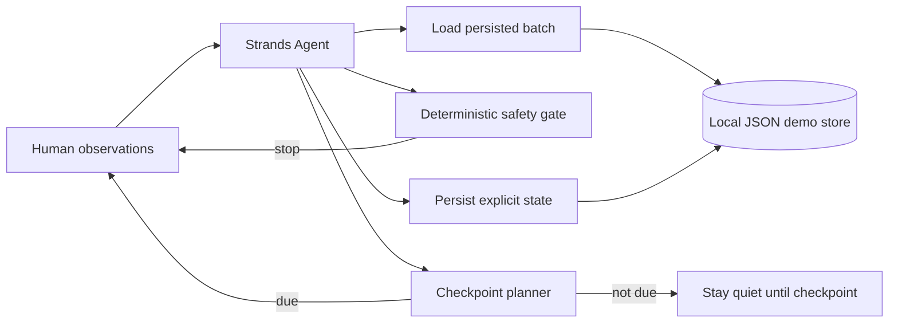

# KVASSISTENT Fermentation Steward — Agents for Humans prototype

This directory contains **new hackathon work started on 2026-08-13** for the Agents for Humans challenge.

It is intentionally separated from the existing KVASSISTENT product. The final competition submission should live in a **new public MIT or Apache-2.0 repository** created during the submission period. This directory is a preparation workspace and migration source, not the final submission repository.

## The idea

KVASSISTENT Fermentation Steward is a human-first autonomous household fermentation agent.

The person performs the physical work and is the only source of sensory observations. The agent remembers batch state, decides when another check is needed, applies deterministic safety gates, and surfaces a decision only when the human needs to act.

The key behavior is deliberately different from a chat recipe bot:

- when nothing is due, it says no action is needed yet;
- when a checkpoint becomes due, it asks for the minimum missing observation;
- it persists state across process restarts;
- it never pretends to see, smell, taste, touch or measure the batch;
- model reasoning cannot override deterministic stop conditions.

## Pre-existing work disclosure

The broader KVASSISTENT product predates this hackathon and is available in `bambuchastudent/kvas-ai-agent` / https://kvassistent.pages.dev/.

The existing product provides the human-first concept, recipe/safety background, batch-state ideas and creator-authored identity. The competition agent implementation in this directory is new work. The final submission README must keep this boundary explicit and list any specific pre-existing schema/content copied into the competition repository.

Do **not** present the historical repository or its earlier releases as work created during the hackathon.

## Architecture



For a stronger final entry, replace/augment the local demo runtime with **Amazon Bedrock AgentCore Runtime/Memory** while preserving deterministic local tests for state transitions and safety gates.

## Requirements

- Python 3.10+
- Strands Agents SDK
- a model/provider configured for Strands when running the agent

The pure workflow tests do not call an LLM or cloud service.

## Run locally

```bash
cd hackathons/agents-for-humans
python -m venv .venv
source .venv/bin/activate
pip install -e .
kvassistent-steward "Start batch demo-1 in primary_fermentation at 28 C. No smell observation yet."
```

State is written by default to `.kvassistent-steward-state.json`. Override it with `KVASSISTENT_STATE_PATH`.

## Run deterministic tests

```bash
cd hackathons/agents-for-humans
PYTHONPATH=src python -m unittest discover -s tests -v
python -m compileall -q src tests
```

## Demo story

A concise judging demo should show:

1. start a batch and persist explicit state;
2. restart the process and recover the same batch;
3. check before the scheduled checkpoint and show that the agent does not bother the human;
4. make the checkpoint due and request one real observation;
5. report a normal observation and continue;
6. report mold/slime/unsafe smell/overheat in a separate test batch and show that the deterministic gate stops the workflow;
7. show the state record and architecture so judges can see what is model-driven versus deterministic.

## Final submission checklist

- [ ] Create a new public competition repository during the submission period.
- [ ] License that repository MIT or Apache-2.0.
- [ ] Copy only the new competition implementation and explicitly disclosed reusable material.
- [ ] Add English README and architecture diagram.
- [ ] Add AgentCore deployment if practical.
- [ ] Publish a working demo judges can access.
- [ ] Record a <=5 minute public demo video.
- [ ] Add AWS Builder ID to the Devpost submission.
- [ ] Keep all credentials out of git.
